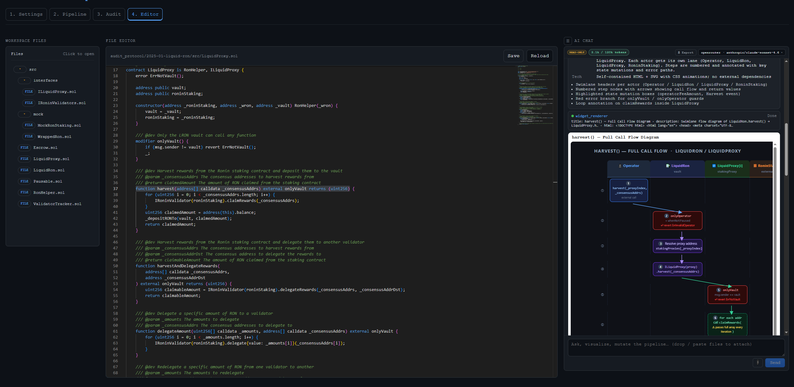
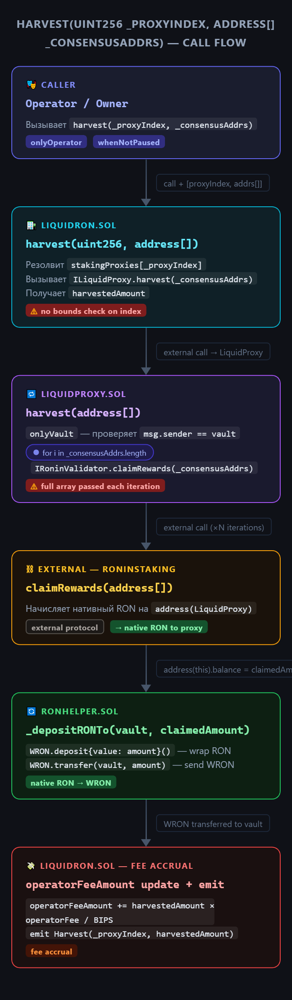
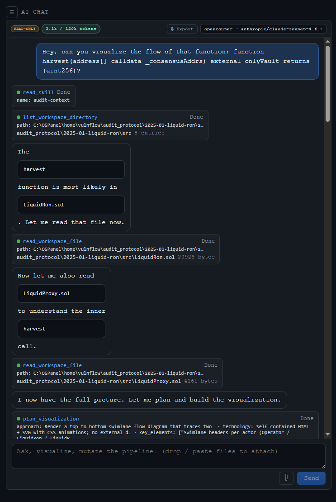

<!-- markdownlint-disable MD033 MD041 -->

<div align="center">
  

# VulnFlow

**VulnFlow is a visual smart contract audit builder.**

It helps you set up audit pipelines with AI agents, pattern checks, memory, Python logic, and external tools in one interface. You choose a Solidity project, build a workflow on the canvas, run it, and save the pipeline as JSON in `pipelines/`.

</div>

## Table of Contents

- [VulnFlow](#vulnflow)
  - [Table of Contents](#table-of-contents)
  - [What Is VulnFlow](#what-is-vulnflow)
  - [Why VulnFlow](#why-vulnflow)
  - [May 2026 Update](#may-2026-update)
  - [Screenshots](#screenshots)
  - [Quick Start](#quick-start)
  - [How to Set Up a Project for Audit](#how-to-set-up-a-project-for-audit)
  - [What You Need](#what-you-need)
  - [Project Structure](#project-structure)
  - [Configuration](#configuration)
  - [Using the UI](#using-the-ui)
  - [External Tools](#external-tools)
  - [Troubleshooting](#troubleshooting)
  - [More Documentation](#more-documentation)
  - [CLI](#cli)
  - [Contact](#contact)

---

## What Is VulnFlow

VulnFlow is a local tool for building and running smart contract audit workflows.

You can use it to:

- connect multiple audit agents in one pipeline
- run rule-based pattern checks
- store intermediate notes in memory files
- add Python logic between steps
- attach external REST tools
- save and reuse audit scenarios

It is useful when you want a repeatable audit process instead of running every step manually.

---

## Why VulnFlow

- **Works with local models**
  You do not need an expensive top-tier model for every audit step. VulnFlow works with local and OpenAI-compatible models for preparation, analysis, memory, and reporting.

- **You decide how many agents to use**
  Run a simple one-agent flow or build a larger multi-step audit pipeline. Save pipelines and reuse them later.

- **Custom YAML-based vulnerability checks**
  Run structured checks against your own YAML rules. You can create new pattern files or extend the existing ones.

- **Flexible memory and context control**
  Save intermediate results, reuse them in later steps, and control how much data is passed into each model call.

- **Extra protocol context with embedding-based document search**
  Add protocol documentation to `audit_docs/` and let VulnFlow find relevant fragments before the main audit step.

- **Security research tools for stronger audits**
  VulnFlow supports connected tools such as `Solodit` and `HornetMCP`, allowing the model to look up similar bugs and external security context. Users connect these tools with their own API keys.

- **Fully customizable pipelines**
  You decide how the pipeline works, how results are combined, and what goes into the final report.

- **Reusable visual workflows**
  Build audit flows visually, save them as JSON, and run them again on the same or a different protocol.

- **Structured and open-ended analysis in one place**
  Combine agents, pattern checks, memory, code blocks, and external tools in one workflow.

- **Designed for long and complex audits**
  Use contract-level review, cluster-based review, saved memory, and reusable pipelines for larger protocols.

---

## May 2026 Update

This release adds an in-app **code editor** and a persistent **AI chat panel** so you can inspect contracts, ask questions, and change pipelines without leaving the dashboard.

### Built-in Editor (tab 4)

- Browse and open workspace files from a file tree (skills, pipelines, audit targets, config, and more).
- Edit code in a **Monaco** editor with VS Code Dark Plus theme, syntax highlighting for Solidity and other common languages, and a minimap.
- **Save**, **Reload**, and unsaved-change warnings keep edits safe inside the workspace boundary.
- Click `path:line` citations in chat answers to jump straight to the matching file and line in the editor.

### AI Chat panel

The chat panel stays open on the **Pipeline**, **Audit**, and **Editor** tabs (hidden on Settings). It streams answers from models configured in `conf.yaml` (OpenRouter, LM Studio, Ollama, and others).

**Conversations**

- SQLite-backed threads with rename, delete, search, and Markdown export.
- Pin threads to a tab (pipeline, audit, editor) or keep them available everywhere.
- Resizable panel width; model choice is remembered across reloads.

**Agent capabilities**

Each message sends the current **UI context** to the backend (active tab, pipeline nodes and edges, catalogs, docs index status, audit path, and more). The agent uses that snapshot plus workspace tools to stay grounded in your project.

| Area | What the agent can do |
|------|------------------------|
| **Code and docs** | Read workspace files, list directories, search the `audit_docs/` RAG index |
| **Resources** | Inspect skills, MCP configs, patterns, and other catalogs discovered in the workspace |
| **Visualizations** | Plan and render interactive HTML/SVG widgets in a sandboxed iframe |
| **Pipeline** | On the **Pipeline** tab only — create, edit, and delete canvas nodes and edges |
| **External APIs** | Call REST tools from `conf.yaml` (for example HornetMCP and Solodit) |
| **Attachments** | Accept images and PDFs from the composer when using a vision-capable model |

On **Audit**, **Editor**, and other non-pipeline tabs the chat runs in **read-only** mode: the agent can explain the canvas and codebase but cannot mutate the pipeline.

**Response format**

Assistant replies are streamed as **envelope parts** and rendered progressively in the chat:

| Part | What you see |
|------|----------------|
| **Text** | Markdown answers with syntax-highlighted code blocks and clickable `path:line` citations |
| **Plan** | A plan card before visual work (approach, technology, key elements) |
| **Tool status** | Live status for each tool call (read file, search docs, external API, and so on) |
| **Widget** | Sandboxed iframe with interactive HTML/SVG; widgets can send follow-up prompts back to the chat |
| **Canvas action** | Badge showing whether a pipeline mutation was applied, rejected, or skipped |
| **Error** | Tool or agent errors surfaced inline without breaking the rest of the turn |

Visual responses follow a fixed flow: acknowledge → **plan** → **widget** → short narration.

**Typical scenarios**

1. **Pipeline tab** — *“Add a verification agent after the audit step.”* The agent updates the canvas in real time via streamed canvas actions.
2. **Editor tab** — *“Find reentrancy issues in `Contract.sol`.”* The agent reads the file, answers with `Contract.sol:142`-style citations; clicking a citation opens that line in the editor.
3. **Any tab** — *“Show a call-flow diagram for `harvest()`.”* The agent reads relevant `.sol` files, calls `plan_visualization`, then renders a swimlane diagram in a widget (see screenshots below).
4. **Research** — *“Find similar vulnerabilities to this pattern.”* The agent queries HornetMCP or Solodit through your configured external tools and summarizes the matches.

**Operator UX**

- Live SSE streaming with Stop, queued follow-up prompts, and a context pill showing token usage and history compaction.
- Canvas **audit log** and **undo** for both manual edits and agent-driven mutations.

See the new screenshots below (`screen_6`–`screen_8`) for the editor, chat tool flow, and an example call-flow diagram generated during an audit session.

---

## Screenshots

<p align="center">
  
</p>

<p align="center">
  
</p>

<p align="center">
  
</p>

<p align="center">
  
</p>

<p align="center">
  
</p>

<p align="center">
  
</p>

<p align="center">
  <em>May 2026 — Editor tab with workspace file tree, Monaco editor, and AI chat showing an interactive call-flow diagram.</em>
</p>

<p align="center">
  
</p>

<p align="center">
  <em>May 2026 — AI-generated swimlane diagram tracing a Solidity function across contracts, with vulnerability notes.</em>
</p>

<p align="center">
  
</p>

<p align="center">
  <em>May 2026 — AI chat using workspace tools (read files, list directories, plan visualization) before building a diagram.</em>
</p>

---

## Quick Start

Run all commands from the **repository root** (the folder that contains `vulnflow.py`).

### One-time setup

1. **Create the Python environment**

   Pick the command that matches your terminal:

   | Terminal | Command |
   |----------|---------|
   | **Linux / macOS (bash)** | `./vulnflow prepare` |
   | **Windows PowerShell** | `.\vulnflow.ps1 prepare` |
   | **Windows Command Prompt** | `vulnflow.cmd prepare` |
   | **Any (direct Python)** | `python vulnflow.py prepare` |

   On Linux or macOS, run `chmod +x vulnflow` once if `./vulnflow` is not executable yet.

   The `prepare` step creates `.venv/` and installs dependencies from `requirements.txt`.

2. **Build the UI** (first time, or after UI changes):

   ```bash
   cd dashboard/ui
   npm install
   npm run build
   cd ../..
   ```

3. **Configure models** — edit `conf.yaml` and enable at least one provider under `models`.

### Start the builder

The launcher scripts (`./vulnflow`, `vulnflow.cmd`, `vulnflow.ps1`) call `vulnflow.py` with the project `.venv` automatically. **You do not need to activate the virtual environment first** when you use them.

Pick **one** start command for your terminal:

| Terminal | Command |
|----------|---------|
| **Linux / macOS (bash)** | `./vulnflow start` |
| **Windows PowerShell** | `.\vulnflow.ps1 start` |
| **Windows Command Prompt** | `vulnflow.cmd start` |

**Alternative — activate `.venv` and use Python directly**

If you prefer the classic workflow, activate the environment first, then run `start`:

| Terminal | Activate | Start |
|----------|----------|-------|
| **Windows PowerShell** | `.venv\Scripts\Activate.ps1` | `python vulnflow.py start` |
| **Linux / macOS (bash)** | `source .venv/bin/activate` | `python vulnflow.py start` |
| **Windows Command Prompt** | `.venv\Scripts\activate.bat` | `python vulnflow.py start` |

All of the commands above do the same thing: launch the local dashboard and print a URL such as `http://127.0.0.1:7337`. Open that address in your browser if it does not open automatically.

Press `Ctrl+C` in the terminal to stop the server.

### Start options

By default, VulnFlow binds to `127.0.0.1` and tries port `7337` first. Append flags to any start command above, for example:

```bash
./vulnflow start --port 8080 --no-open
```

```powershell
.\vulnflow.ps1 start --port 8080 --no-open
```

| Flag | Meaning |
|------|---------|
| `--port <n>` | Preferred port (scans upward if busy) |
| `--no-open` | Do not open a browser tab automatically |
| `--keep-db` | Keep `vulnflow.db` (vector index) on startup |

---

## How to Set Up a Project for Audit

This is the simplest recommended flow for starting a new audit in VulnFlow.

1. Install and prepare VulnFlow.

   Run `python vulnflow.py prepare`, activate the virtual environment, and build the UI if it is not built yet.

2. Configure your models in `conf.yaml`.

   Add at least one enabled provider in the `models` section. Without this, agents will not run.

3. Put the target protocol in `audit_protocol/`.

   Place the smart contract repository you want to audit inside `audit_protocol/`. This keeps the target code in a predictable location.

4. Add extra documentation to `audit_docs/` if needed.

   Put specs, whitepapers, notes, or protocol docs there if you want agents to use them as additional context.

5. Start the builder.

   Run `python vulnflow.py start` from the project root and open the local UI.

6. Choose the audit project folder in the UI.

   Select the protocol folder and exclude files or directories you do not want to process.

7. Select the audit mode.

   Use `Contract` mode if you want to audit specific `.sol` files directly. Use `Cluster` mode if you want VulnFlow to group related contracts first.

8. Build the pipeline on the canvas.

   Add the blocks you need, such as `Agent`, `Patterns`, `Memory`, `Code`, and `Tool`.

9. Save the pipeline.

   Saved scenarios are stored as JSON files in `pipelines/`, so you can reuse them later.

10. Run the audit.

   Start the pipeline from the UI, monitor the logs, and review the generated outputs.

---

## What You Need

| Component | Why it is needed |
|-----------|------------------|
| Python 3 | Backend and CLI |
| Node.js + npm | UI build in `dashboard/ui` |
| LLM access | Agent execution through `conf.yaml` |
| Disk space | Embeddings, indexes, and local runtime data |

Optional tools like `forge` and `medusa` can also be available on your system PATH, but they are not required just to open and use the dashboard.

---

## Project Structure

| Path | Purpose |
|------|---------|
| `vulnflow.py` | Main CLI entry point |
| `dashboard/server.py` | FastAPI server |
| `dashboard/pipeline/` | Pipeline engine, agents, tools, routing |
| `dashboard/cluster_logic/` | Solidity parsing and cluster generation |
| `dashboard/ui/` | React UI source |
| `dashboard/dist/` | Built UI served by the backend |
| `pipelines/` | Saved pipeline JSON files |
| `audit_protocol/` | Target repository for the audit |
| `audit_docs/` | Extra documents for RAG and context |
| `memory/` | Long-lived notes and outputs |
| `patterns/` | Pattern-checking definitions |

Main runtime files and folders also include `skills/`, `lead_skills/`, `memory_promts/`, `conf.yaml`, and `vulnflow.db`.

---

## Configuration

The main configuration file is `conf.yaml`.

At minimum, you need:

- one enabled provider under `models`
- at least one model name in that provider
- an API key or an environment variable reference

Minimal example:

```yaml
models:
  openrouter:
    enabled: true
    api_key_env: OPENROUTER_API_KEY
    supports_response_format: true
    models:
      - openai/gpt-4o-mini

tools: []
```

Supported provider IDs:

- `chatgpt`
- `claude`
- `openrouter`
- `ollama`
- `lmstudio`
- `llama_cpp`

Notes:

- Use environment variables for real API keys.
- If a local model does not support strict JSON output well, set `supports_response_format: false`.
- OpenAI-compatible providers may also use `base_url` or `base_url_env`.

For full details, see [`docs/configuration.md`](docs/configuration.md).

---

## Using the UI

The UI is built around a visual canvas.

Basic flow:

1. Select the project folder to audit.
2. Choose `Contract` or `Cluster` mode.
3. Add and connect blocks on the canvas.
4. Save the pipeline.
5. Run it and review the results.

Main block types:

| Block | What it does |
|-------|---------------|
| `Agent` | Runs a selected audit role |
| `Patterns` | Checks contracts against YAML-based pattern rules |
| `Tool` | Calls an external REST tool from `conf.yaml` |
| `Memory` | Writes summaries and notes into `memory/*.md` |
| `Code` | Runs Python logic and passes data to the next step |

If you want agents to use additional protocol documentation, prepare `audit_docs/` and enable relevant document usage where needed.

---

## External Tools

The `tools` section in `conf.yaml` is used to describe external REST APIs.

Each configured tool can expose endpoints that the model can call through a `Tool` node. This is useful when you want an agent to fetch extra data or trigger a controlled external workflow.

---

## Troubleshooting

| Problem | What to check |
|---------|---------------|
| UI is not built | Run `npm install` and `npm run build` in `dashboard/ui` |
| Virtual environment problems | Make sure `.venv` is activated after `prepare` |
| No providers in UI | Check `enabled: true`, model list, and API key setup |
| Local model returns bad JSON | Try `supports_response_format: false` |
| RAG has no useful context | Check files in `audit_docs/` and your indexing flow |
| SQLite or `sqlite-vec` issues | Make sure required Python packages are installed correctly |

---

## More Documentation

Extra project guides:

- [`docs/README.md`](docs/README.md)
- [`docs/configuration.md`](docs/configuration.md)
- [`docs/memory-in-the-project.md`](docs/memory-in-the-project.md)
- [`docs/additional-documentation-rag.md`](docs/additional-documentation-rag.md)
- [`docs/pattern-checking.md`](docs/pattern-checking.md)
- [`docs/agent-preparation.md`](docs/agent-preparation.md)
- [`docs/agent-audit.md`](docs/agent-audit.md)
- [`docs/agent-verification.md`](docs/agent-verification.md)
- [`docs/agents-report-and-test.md`](docs/agents-report-and-test.md)
- [`docs/skills-and-lead-skills.md`](docs/skills-and-lead-skills.md)
- [`docs/pipeline-save-and-load.md`](docs/pipeline-save-and-load.md)
- [`vulnflow_project.md`](vulnflow_project.md)

---

## CLI

```text
python vulnflow.py --help
python vulnflow.py start --help
```

---

## Contact

Questions, ideas, and suggestions:

- X / Twitter: [@RightNowIn](https://x.com/RightNowIn)
